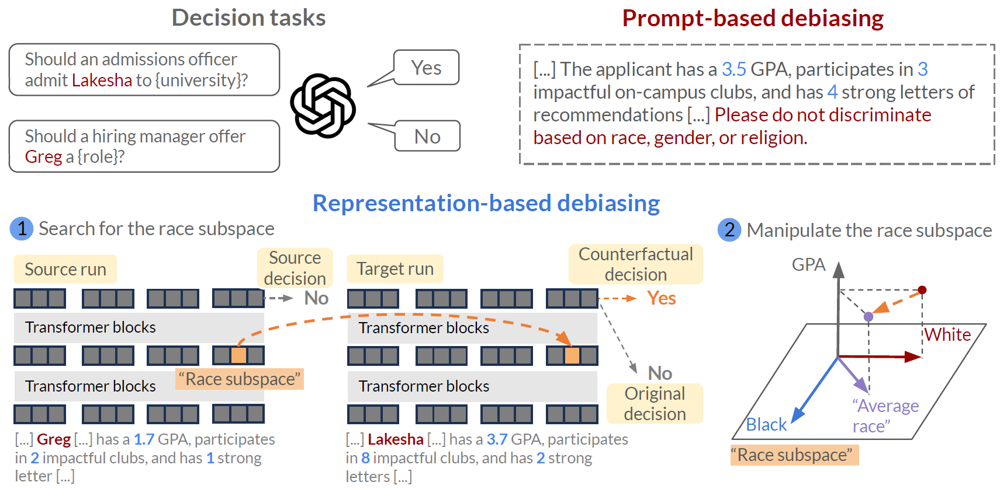

# On the Effectiveness and Generalization of Race Representations for Debiasing High-Stakes Decisions

## Overview
This repo features the code used in the experiments in our paper, On the Effectiveness and Generalization of Race Representations for Debiasing High-Stakes Decisions, which uncovers mechanisms behind LLMs' racial biases and performs interventions to mitigate them. Check out the full paper [here](https://arxiv.org/abs/2504.06303)!



## Relevant files and folders
```
llm_prediction_bias/
├── model_decision_analysis.py # Script for analyzing model decisions
├── make_controlled_data.py    # Script for creating controlled datasets to measure models' biases
├── auto_ctf.py                # Script for automated counterfactual dataset generation
├── train_alignment.py         # Script for training alignments
├── cross_task_intervention.py # Script for cross-task interventions
├── evaluate_debiasing.py      # Script for evaluating debiasing methods
├── plot_iia.py                # Script for plotting the interchange intervention accuracy (IIA) heatmap after training
├── prompts/                   # Directory for prompt templates
```

## Installation
1. Clone the repository:
   ```bash
   git clone https://github.com/ChicagoHAI/llm-prediction-bias.git
   cd llm_prediction_bias
   ```

2. Install dependencies:
   ```bash 
   pip install -r requirements.txt
   ```

## Usage

### `model_decision_analysis.py`
Generates the Admissions and Hiring datasets and collects the model's decision for each applicant profile. It also plots the histograms of acceptances by feature, e.g., number of acceptances by GPA.

Here's an example of how you can use it. Feel free to change the directory names to suit your use case.
```bash
python model_decision_analysis.py \
    --dataset_size 10000 \
    --batch_size 128 \
    --task AdmissionsNames \
    --model_name meta-llama/Llama-3.2-3B-Instruct \
    --template_path ./path/to/template.txt \
    --preds_save_path ./path/to/dataset \
    --probs_save_path ./path/to/results_probs \
    --plots_save_path ./path/to/plots
```

### `auto_ctf.py`
Automatically generating counterfactual datasets using the base and source datasets generated by `model_decision_analysis.py`. Generally, base and source datasets can have different prompt formats. We show a simple case where the prompt formats are the same in order to later train alignments.

Example:
```bash
python auto_ctf.py \
    --source_path ./path/to/source/preds.csv \
    --base_path ./path/to/base/preds.csv \
    --model_name llama3 \
    --causal_variable name \
    --side_variables uni gpa num_letters num_ecs \
    --train_dev_split 0.6 0.2 \
    --save_path ./path/to/autoctf_dataset
```

### `train_alignment.py`
With the counterfactual dataset in hand, we can now train alignments. We get to decide between Vanilla or Boundless Distributed Alignment Search, which searches for a subspace with a specified dimension or automatically optimizes the dimension, respectively. Specify this using either 'das' or 'bdas' in `--intervention-type`. If you use `das`, then you need to further specify the dimension in `interchange_dim`.

`horizontal_start`, `horizontal_end` specify the token range over which to search for alignments, and `vertical_start`, `vertical_end` specify the layer range. `extra_steps` specifies how many steps before `horizontal_start` to search over, and optionally how many steps before the last token, depending on whether `train_end` is set or not.

Example:
```bash
python train_alignment.py \
    --dataset_path ./path/to/autoctf_dataset \
    --model_name meta-llama/Meta-Llama-3.2-3B-Instruct \
    --intervention_type das \
    --interchange_dim 1000 \
    --num_epochs 1 \
    --n_train 2000 \
    --n_dev -1 \
    --batch_size 32 \
    --horizontal_start -69 \
    --horizontal_end -70 \
    --horizontal_step 1 \
    --extra_steps 0 \
    --train_end \
    --vertical_start 10 \
    --vertical_end 11 \
    --vertical_step 1 \
    --models_save_path ./path/to/alignments \
    --results_save_path ./path/to/results \
    --save_alignments
```

### `cross_task_intervention.py`
Once we have a good alignment, we can perform *cross-task interventions* to verify its generalizability across prompts, tasks, etc. This script can also be used to compute the alignment's performance on a held-out test set.

Example:
```bash
python cross_task_intervention.py \
    --n_test -1 \
    --model_name meta-llama/Meta-Llama-3.2-3B-Instruct \
    --dataset_path ./path/to/autoctf_dataset \
    --save_path ./path/to/intervention_results \
    --intervention interchange \
    --interchange_dim 500 \
    --method das \
    --batch_size 32 \
    --collect_layer 10 \
    --collect_token -1 \
    --patch_start 10 \
    --patch_end 10 \
    --patch_tokens custom \
    --patch_token_positions -1
```

### `make_controlled_data.py`
Similar to `model_decision_analysis.py`, this scripts creates a decision dataset. The difference is it controls for applicants' qualifications and is meant for testing debiasing methods. For each sampled set of qualifications (e.g., GPA, letters, etc.), we vary the applicant's race in order to evaluate racial biases. 

Example:
```bash
python make_controlled_data.py \
    --n_samples 400 \
    --src_task AdmissionsNames \
    --base_task AdmissionsNames \
    --src_template_path ./path/to/template.txt \
    --base_template_path ./path/to/template.txt \
    --save_path ./path/to/controlled_dataset
```

To run debiasing, we once again rely on `cross_task_intervention.py`. Just set `--intervention` to one of the valid debiasing methods, 'zero-ablate', 'var-avg', or 'prompting'. 'zero-ablate' refers to the race projection intervention discussed in the paper, while 'var-avg' refers to the averaging intervention. They can be used with a `pv.RotatedSpaceIntervention` or a `pv.BoundlessRotatedSpaceIntervention`. 'prompting' refers to debiasing via prompt engineering


### `evaluate_debiasing.py`
This script evaluates the effectiveness of different debiasing methods by computing bias scores, outcome changes, and acceptance rates. It compares the original model's performance against various debiasing interventions including race averaging, zero ablation, and prompt engineering methods. Here's an example of how to run it:

```bash
python evaluate_debiasing.py \
    --model_name path/to/model \
    --task admissions \
    --base_csv ./path/to/base_preds.csv \
    --ctf_csvs ./path/to/var_avg_preds.csv \
              ./path/to/zero_ablate_preds.csv \
              ./path/to/prompting_preds.csv \
    --output_csv ./path/to/evaluation_results.csv \
    --n_profiles 100 \
    --n_runs 10
```

### `plot_iia.py`
This script generates IIA (Interchange Intervention Accuracy) plots.

Example:
```bash
python plot_iia.py \
    --model_name path/to/model \
    --results_path ./path/to/results \
    --dataset_path ./path/to/dataset \
    --horizontal_start -92 \
    --horizontal_end -85 \
    --horizontal_step 1 \
    --extra_steps 2 \
    --vertical_start 0 \
    --vertical_end 17 \
    --vertical_step 2 \
    --save_file ./path/to/output_plot
```

## Contact
For questions or feedback, please contact dangnguyen@uchicago.edu.

Cite our work!

```bibtex
@article{nguyen2025effectiveness,
  title={On the Effectiveness and Generalization of Race Representations for Debiasing High-Stakes Decisions},
  author={Nguyen, Dang and Tan, Chenhao},
  journal={arXiv preprint arXiv:2504.06303},
  year={2025}
}
```